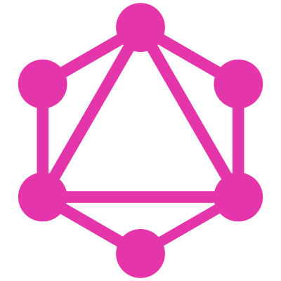

# 👋 Hey, I'm Alberto Camarena

Mechatronics Engineer from Mexico 🇲🇽, currently building and supporting developer communities through technology, education, and mentorship.

## About me

- 🧑‍💻 Sr. Specialist at **[MongoDB](https://www.mongodb.com/)**
- 🧠 Major League Hacking Coach at **[MLH](https://mlh.io)**
- 🎓 GitHub Campus Expert Alumni
- 💬 Always happy to chat about **PCs, custom keyboards, and developer tooling**
- ☕ Coffee enthusiast | 🪴 Plant lover | 📷 Photography fan

## Connect with me

- 📫 **Email:** <alberto@camarena.me>
- 💻 **LinkedIn:** [albertocamarena-dev](https://www.linkedin.com/in/albertocamarena-dev)

## Favorite technologies

> Tools, languages, and platforms I enjoy working with.

<table>
  <tr>
    <td align="center" width="96">
      
       JavaScript
    </td>
    <td align="center" width="96">
      
       TypeScript
    </td>
    <td align="center" width="96">
      
       Node.js
    </td>
    <td align="center" width="96">
      
       React
    </td>
    <td align="center" width="96">
      
       Angular
    </td>
    <td align="center" width="96">
      
       Python
    </td>
    <td align="center" width="96">
      
       MATLAB
    </td>
    <td align="center" width="96">
      
       GraphQL
    </td>
    <td align="center" width="96">
      
       Lua
    </td>
  </tr>
</table>

<!-- In the future, I'd like to add more non-dev projects like 3D printing and modeling. -->
